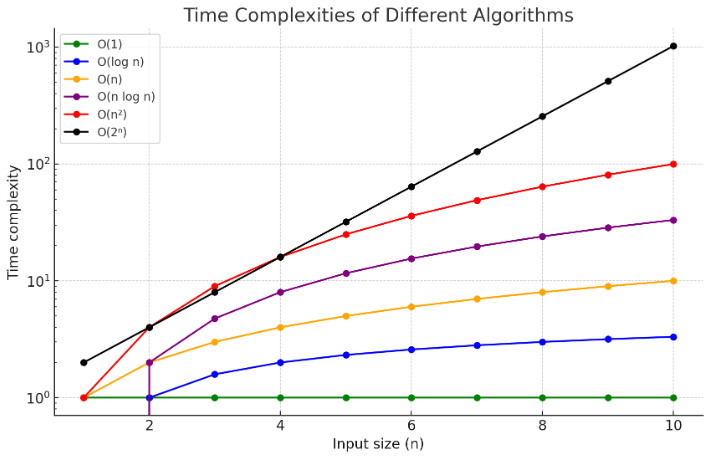
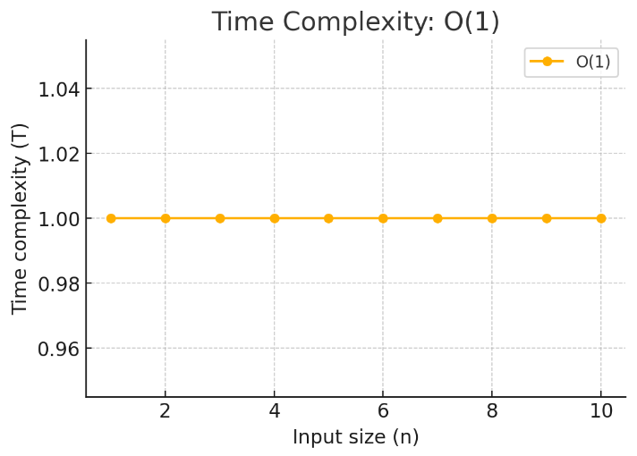
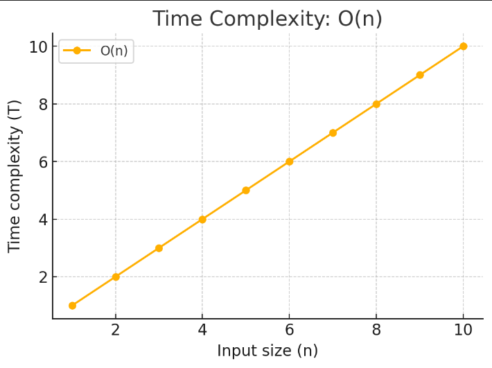
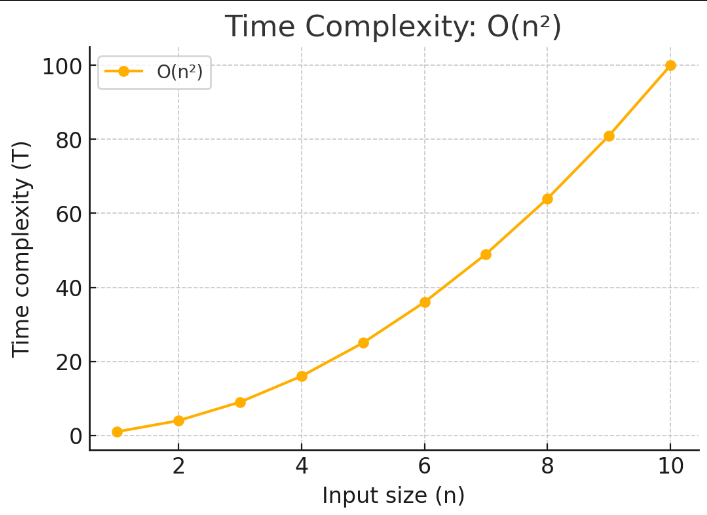
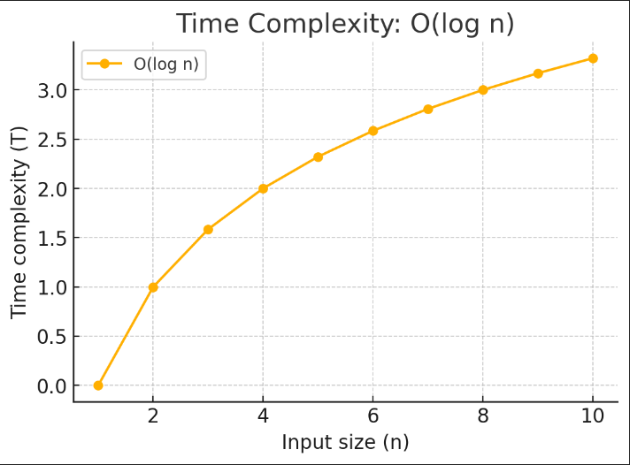
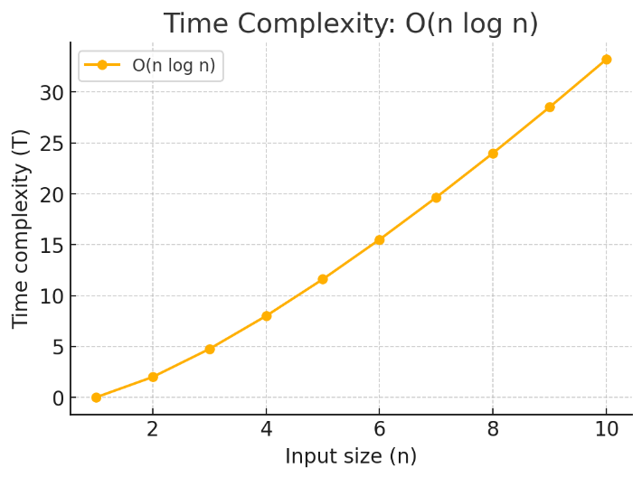
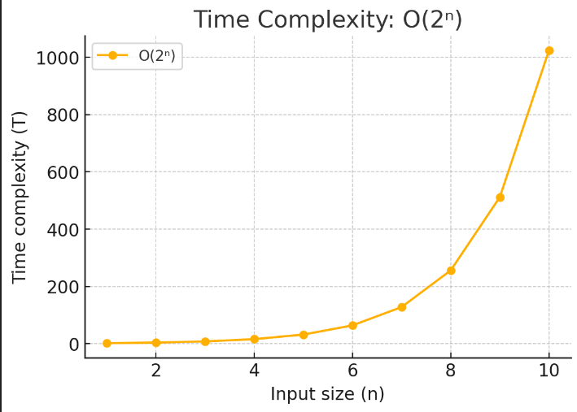

# Understanding Time Complexities in Algorithms

In this section, we'll go over the most common time complexities used in algorithm analysis. These complexities describe how the running time of an algorithm increases with the size of the input (`n`). Let's take a look at each of these complexities, their formulas, descriptions, examples, and graphs.

## General Time Complexity Graph

  

---

## 1. Constant Time – O(1)

  

- **Formula:** `T = O(1)`
- **Description:** The time taken by the algorithm does not change with the input size. It remains constant regardless of the size of the input.
- **Example:** Accessing an element by its index in an array.
- **Graph Explanation:** A horizontal line parallel to the X-axis, indicating no change in time as `n` increases.

---

## 2. Linear Time – O(n)

  

- **Formula:** `T = O(n)`
- **Description:** The running time increases linearly with the size of the input. If the input size doubles, the running time also doubles.
- **Example:** Iterating through all elements of an array.
- **Graph Explanation:** A straight line that grows steadily as the size of the input increases.

---

## 3. Quadratic Time – O(n²)

  

- **Formula:** `T = O(n²)`
- **Description:** The running time increases quadratically as the input size increases. If the input size doubles, the time taken increases fourfold.
- **Example:** A nested loop iterating over an array twice.
- **Graph Explanation:** A steep curve, rising rapidly as `n` increases.

---

## 4. Logarithmic Time – O(log n)

  

- **Formula:** `T = O(log n)`
- **Description:** The running time increases logarithmically as the input size grows. This means the time grows much slower as `n` increases, for example, when repeatedly dividing a list in half.
- **Example:** Binary search in a sorted array.
- **Graph Explanation:** A curve that rises sharply at first but flattens out as `n` increases.

---

## 5. Linearithmic Time – O(n log n)

  

- **Formula:** `T = O(n log n)`
- **Description:** This is common in efficient sorting algorithms like Merge Sort and Quick Sort. The time grows more than linearly, but less than quadratically.
- **Example:** Merge Sort algorithm.
- **Graph Explanation:** A curve that grows faster than O(n), but slower than O(n²).

---

## 6. Exponential Time – O(2ⁿ)

  

- **Formula:** `T = O(2ⁿ)`
- **Description:** The running time doubles with each additional input element. These algorithms are typically inefficient and impractical for large inputs.
- **Example:** Solving the Traveling Salesman Problem using brute force.
- **Graph Explanation:** A curve that rises extremely steeply, growing faster than any other common time complexity.
